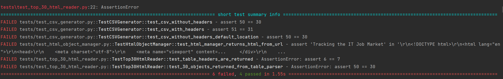
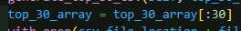
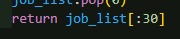
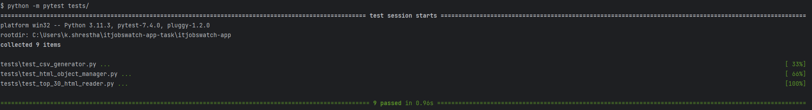
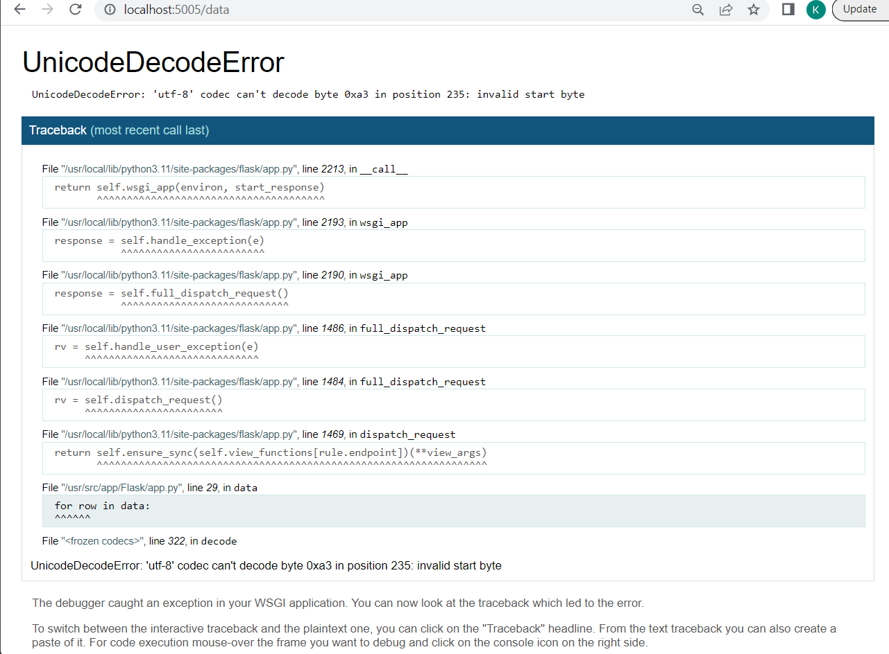
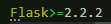

# Itjobswatch App

Team 1:

- Elena
- Larisha
- Deanne
- Ashley
- Kevin
- Krzysztof


## Containerizing the App:

## Install Dependencies:
Before containerizing the app, ensure all necessary dependencies are installed in your development environment. This may include packages specified in the requirements.txt file. Install them using pip or any other package manager you prefer.

## Run Tests:
Run the test suite to ensure that the application functions correctly. This step is essential to verify that the app works as expected and to catch any issues before containerizing.

## Run the App:
Test the app by running it in your local development environment. Make sure it operates without any errors and that all functionalities work as intended.

### Blocker: Missing Dependencies.
If any required dependencies are missing, manually install them using the appropriate package manager, and don't forget to update the requirements.txt file with the new dependencies and their versions.

### Blocker: Test Failures.
If the app's code changes have led to test failures, modify the test cases to match the updated version of the app. Ensure that the tests correctly cover the application's functionalities.









### Blocker: App.py Not Running.
If you encounter issues with the "Markup" in the newer version of Jinja2, try downgrading Jinja2 to a compatible version. This should resolve the problem.





### Adding Encoding Argument:
To handle non-standard ASCII characters in the CSV file, add the encoding='ISO-8859-1' argument when opening the file in app.py. This ensures proper handling of character encoding.

```python
def data():
    with open('Flask/Downloads/ItJobsWatchTop30.csv', encoding='ISO-8859-1') as csv_file:
        # Rest of the code...


## Adding yaml file to deploy the app

```

# Deploy itjobswatch
---


apiVersion: apps/v1
kind: Deployment

metadata:
  name: itjobswatch-deployment
spec:
  selector:
    matchLabels:
      app: itjobswatch

  replicas: 3

  template:
    metadata:
      labels:
        app: itjobswatch

    spec:
      containers:
      - name: itjobswatch
        image: ellieckay/tech241-itjobs:v1
        ports:
        - containerPort: 5000


# App service (SVC)
---
apiVersion: v1
kind: Service

metadata:
  name: itjobswatch-svc
  namespace: default

spec:
  ports:
  - nodePort: 30005
    port: 5000
    targetPort: 5000

  selector:
    app: itjobswatch

  type: NodePort

```