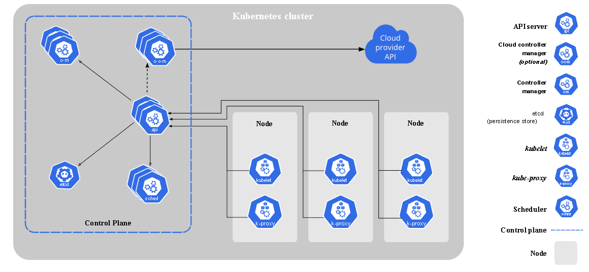
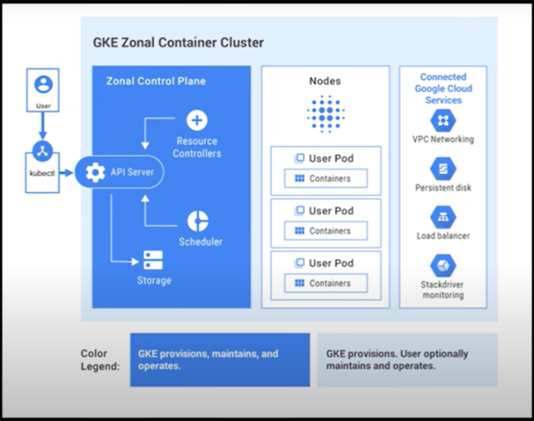

# Kubernetes (K8s)

## What is K8s?

- Kubernetes (K8s) is an open-source platform that manages containerized applications.
- It automates deployment, scaling, and management of containers.
- Google developed it, and it's now maintained by CNCF.



## Why use and learn K8s?

- Scalability: Easily scale applications based on demand.
- High availability: Ensures applications are always running, even after node failures.
- Portability: Consistently deploy applications across various environments.
- Automation: Automates many tasks, making development and operations smoother.
- Community: Large community and ecosystem support.

## Benefits to business

- Cost-effectiveness: Optimize resource utilization, reducing infrastructure costs.
- Faster time-to-market: Automate deployment for quicker application development.
- Improved reliability: Kubernetes manages application health, enhancing reliability.
- Enhanced collaboration: Promotes DevOps practices for smoother teamwork.
- Competitive advantage: Staying current with Kubernetes keeps businesses competitive.

## What are K8s objects?

- Persistent entities representing the cluster or applications.
- Examples: Pods, Services, Deployments, ConfigMaps, Secrets.
- Each object has a defined specification and interacts with others.
- Managed using Kubectl or Kubernetes API.



## Concepts of labels and selectors

- Labels: Key-value pairs for identifying and categorizing K8s objects.
- Flexible use: Group objects based on application version, environment, etc.
- Selectors: Used to identify a set of objects based on their labels.
- Commonly used with ReplicationControllers, ReplicaSets, Deployments.
- Important for managing and scaling applications in Kubernetes.


#### YAML script for nginx

```
# K8 works with API versions to declare the resources
# We have to delclare the apiVersion and the kind of service/component
# services: deployment, service, pods, replicasets, crobjob, autoscalinggroup, horizontal pod scaling group (HPA)
# Kubect get service_name - deployment - pod - rs
# kubectl get deploy nginx_deploy (nginx_svc)
# kubectl get pods 
# kubect describe pod pod_name
# 


# YML is case sensitive - intendation of YML is important
# use spaces not a tab
apiVersion: apps/v1 # which api to use for deployment
kind: Deployment # what kind of service/object you want to create
# what would you like to call it - name the service/object
metadata:
  name: nginx-deployment # naming the deployment
spec:
  selector:
    matchLabels:
      app: nginx # look for this label to match with k8 service
    # Let's create a replica set of this with  instances/pods
  replicas: 4             
    # template to use it's label for K8 service to launch in the browser
  template:
    metadata:
      labels:
        app: nginx # This label connects to 
                   #the service or any other k8 components
  # Let's define the container spec
    spec:
      containers:
      - name: nginx 
        image: ahskhan/eng89automatednginx:latest # use the image that you built
        ports:
        - containerPort: 80

# create a kubernetes nginx-service.yml to create a k8 service
```

#### YAML script to deploy node app

A blocker I had with this was the version. Its must be the same version that I run. Filename: app-deploy.yml

```
apiVersion: apps/v1
kind: Deployment

metadata:
  name: app-deployment
spec:
  selector:
    matchLabels:
      app: app

  replicas: 3

  template:
    metadata:
      labels:
        app: app

    spec:
      containers:
      - name: app
        image: ellieckay/tech241-app-new:v2
        ports:
        - containerPort: 3000

```

### Docker and Kubernetes Commands

| Command                                          | Description                                                                                  |
|--------------------------------------------------|----------------------------------------------------------------------------------------------|
| `docker build -t ellieckay/tech241-app-new:v2 .` | Build a Docker image with the tag `ellieckay/tech241-app-new:v2` from the current directory (`.`) |
| `docker run -d -p 3000:3000 ellieckay/tech241-app-new:v2` | Run a container in detached mode (`-d`) mapping port 3000 from the host to port 3000 in the container, using the `ellieckay/tech241-app-new:v2` image |
| `docker ps`                                      | List all running Docker containers                                                           |
| `docker commit 15389e2f839a ellieckay-tech241-app-new:v2` | Create a new image (`ellieckay-tech241-app-new:v2`) from changes in a running container (`15389e2f839a`) |
| `docker push ellieckay/tech241-app-new:v2`       | Push the `ellieckay/tech241-app-new:v2` image to a Docker registry (assuming you have permissions to do so) |
| `kubectl create -f nginx-k8.yml`                 | Create Kubernetes resources (e.g., deployments, services) defined in the `nginx-k8.yml` file |
| `kubectl get deployment`                         | Get a list of deployments in the Kubernetes cluster                                       |

Please note that the `kubectl` commands assume you have the Kubernetes command-line tool (`kubectl`) installed and configured properly to work with your Kubernetes cluster.


## Implement Self Healing

If you delete a pod, another one will be created - Self healing.

To do this you need to make a SVC in a service file. Filename: app-service.yml

```
---

apiVersion: v1 # Relates to the version from deploy file
kind: Service

metadata:
  name: app-svc
  namespace: default # Used if multiple people are using the container

spec:
  ports:
  - nodePort: 30002
    port: 3000 # Relates to the containerPort in deploy file
    targetPort: 3000

  selector:
    app: app # Relates to the label int he deploy file

  type: NodePort

```

## Run through comands for app deployment

Use the files in the folder app-files. In the folder you will also need the app folder. For the app Dockerfile you need the environment variable which contains the mongodb ip address this can be found by doing `docker inspect <mongodb-img-id>`.

Steps:

1. Build the image
2. run the image on the correct port (3000)
3. deploy 3 instances using the deploy yaml file
4. Check it has worked
5. Create the SVC which will enable self healing
6. Check SVC
7. Check the pods

```
docker build -t ellieckay/tech241-app-new:v2 .
docker run -d -p 3000:3000 ellieckay/tech241-app-new:v2
kubectl create -f app-deploy.yml
kubectl get deployment
kubectl create -f app-service.yml
kubectl get svc
kubectl get pods

```

How to remove everything:

Remove SVC = `kubectl delete svc <svc-name>`
Remove deployment = `kubectl delete deployment <deployment name>`
Remove img = ` docker rm -f `
Delete image from the docker app when it is not in use.


## Add MongoDB

This should be run before the app. A config file must be created to replace the original mongodb one as the bind ip has to be changed to 0.0.0.0. This file must be in the same file or the path must be changed in the dockerfile.

```
docker build -t ellieckay/tech241-mongodb:v1 .
docker run -d -p 27017:27017 ellieckay/tech241-mongodb:v1
kubectl create -f mongodb-deploy.yml
kubectl exec app-pod-name  env node seeds/seed.js # Seeds the data
```